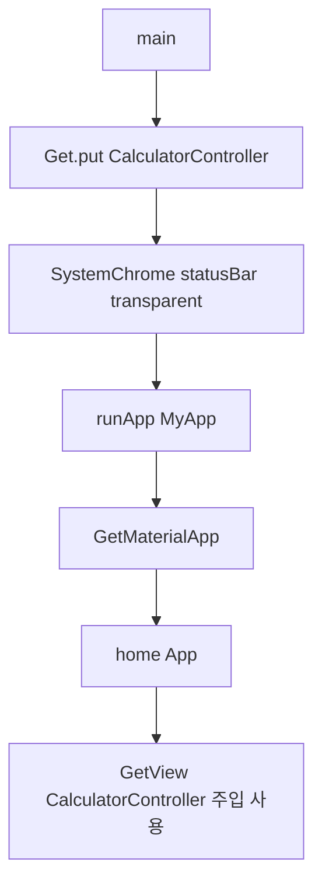
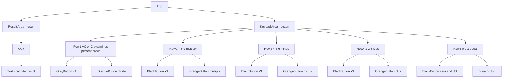
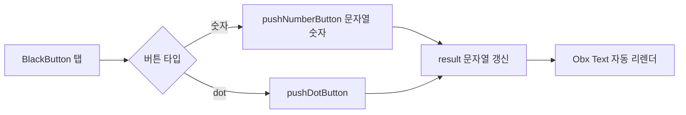
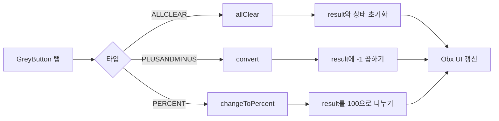
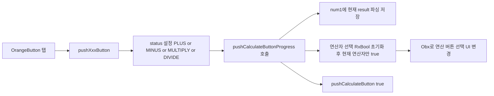
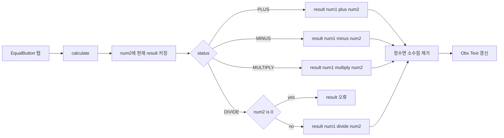
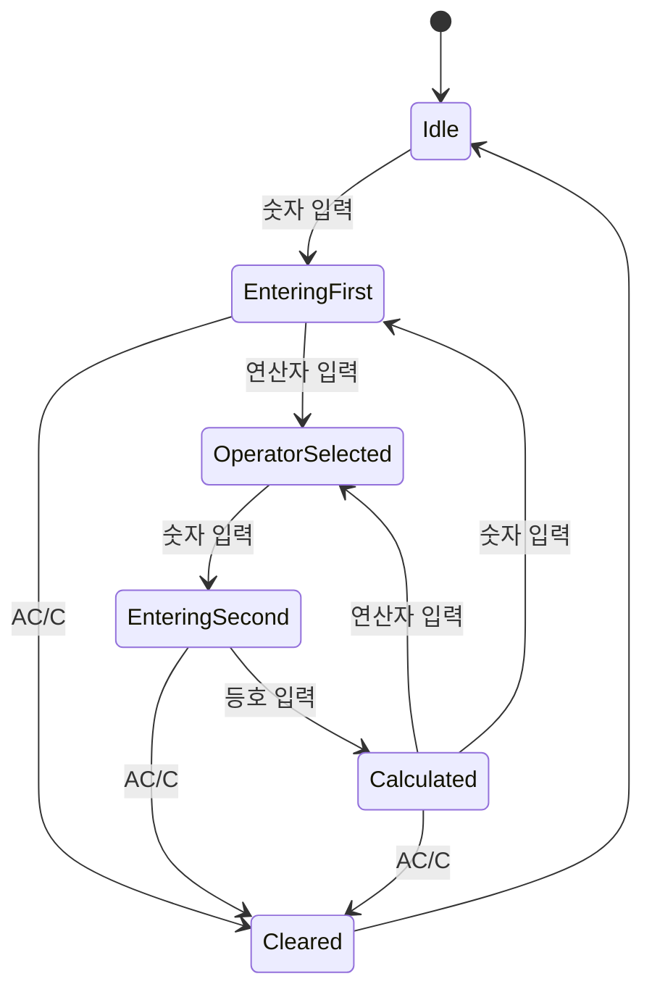

# my_ios_calculator

iOS 기본 계산기 UI/UX를 Flutter로 구현한 프로젝트입니다.
이 문서는 위젯 플로우, 버튼 이벤트, 컨트롤러 함수 동작을 mermaid 다이어그램과 함께 코드 기준으로 자세히 설명합니다.

## 개요

- UI 프레임워크: Flutter
- 상태 관리: GetX
- 핵심 구조:
	- 화면(UI): `App` 위젯
	- 상태/로직: `CalculatorController`
	- 버튼 컴포넌트: `BlackButton`, `GreyButton`, `OrangeButton`, `EqualButton`

## 앱 시작 플로우



1. `main()`에서 `Get.put(CalculatorController())`로 컨트롤러를 DI 컨테이너에 등록합니다.
2. 상태바 스타일을 투명으로 설정합니다.
3. `runApp(MyApp)` 이후 루트 앱은 `GetMaterialApp`으로 실행됩니다.
4. `home`은 `App` 위젯이며, `App`은 `GetView<CalculatorController>`를 통해 컨트롤러를 바로 참조합니다.

## 위젯 트리 흐름

`App`의 `build()`는 크게 2영역입니다.

- 상단 결과 영역 (`_result`)
	- `Obx(() => Text(controller.result))`
	- `result`가 바뀔 때마다 텍스트가 자동 갱신됩니다.

- 하단 키패드 영역 (`_button`)
	- 5개의 Row(첫째 줄 ~ 다섯째 줄)
	- 각 Row에 버튼 타입별 컴포넌트를 배치



## 버튼 컴포넌트 역할

### 1) 숫자/소수점 버튼 (`BlackButton`)

- 숫자 버튼은 `controller.pushNumberButton('N')` 호출
- 점(.) 버튼은 `controller.pushDotButton()` 호출
- 0 버튼은 가로로 긴 형태(아이폰 계산기 스타일)



### 2) 기능 버튼 (`GreyButton`)

- AC/C 버튼: `controller.allClear()` 호출
	- 현재 결과가 `0`이면 `AC`, 아니면 `C` 텍스트를 표시
	- 표시 변경은 `Obx`로 반응형 처리
- +/- 버튼: `controller.convert()` 호출
- % 버튼: `controller.changeToPercent()` 호출



### 3) 연산자 버튼 (`OrangeButton`)

- +, -, ×, ÷ 각각 전용 메서드 호출
	- `pushPlusButton()`, `pushMinusButton()`, `pushMultiplyButton()`, `pushDivideButton()`
- 선택된 연산자는 컨트롤러의 RxBool(`plus`, `minus`, `multiply`, `divide`)로 관리
- 선택 상태에 따라 버튼 아이콘 컬러가 반전되며, `AnimatedOpacity`로 전환 애니메이션 적용



### 4) 결과 버튼 (`EqualButton`)

- `controller.calculate()` 호출
- 현재 연산 상태(`status`)를 기준으로 최종 계산 수행



## 상태 관리 흐름 (CalculatorController)

주요 상태는 다음과 같습니다.

- `result` (RxString): 화면에 표시할 현재 값
- `num1`, `num2` (double): 계산 피연산자
- `status` (enum Calculate): 현재 선택된 연산자
- `pushCalculateButton` (bool): 연산자 입력 직후 상태 플래그
- `_pushPlus`, `_pushMinus`, `_pushMultiply`, `_pushDivide` (RxBool): 연산 버튼 선택 표시용



### 상태 전이 핵심

1. 숫자 입력
	 - 연산자 직후라면 화면을 초기화하고 새 숫자 입력 시작
	 - 기존 값이 `0` 한 자리면 제거 후 숫자 append

2. 연산자 입력
	 - 현재 화면 값을 `num1`로 저장
	 - 연산자 하이라이트 상태 갱신
	 - 다음 숫자 입력에서 새 피연산자를 받기 위해 `pushCalculateButton = true`

3. `=` 입력
	 - 현재 화면 값을 `num2`로 저장
	 - `status`에 따라 계산 수행
	 - 결과가 정수면 소수점 제거(예: `21.0` -> `21`)
	 - 0으로 나누기 시 `오류` 표시

## 함수별 상세 동작

아래는 `CalculatorController`의 핵심 함수가 어떤 순서로 동작하는지 정리한 내용입니다.

### `initPushCalculateStatus()`

- 역할: 연산자 선택 표시용 RxBool을 모두 `false`로 초기화
- 호출 지점:
	- `allClear()`
	- `pushNumberButton()` 내부 (연산자 누른 직후 새 숫자 입력 시)
	- `pushCalculateButtonProgress()` 내부

### `initResultNumber()`

- 역할: 표시 문자열을 `0`으로 초기화
- 호출 지점:
	- `allClear()`
	- `pushNumberButton()` 내부 (연산자 누른 뒤 첫 숫자 입력)

### `allClear()`

- 수행 순서:
	1. 연산자 선택 상태 초기화
	2. 표시값 `0`으로 초기화
	3. `num1`, `num2`를 0으로 초기화
	4. `status`를 `NONE`으로 변경

### `pushNumberButton(String value)`

- 수행 규칙:
	1. 직전이 연산자 입력(`pushCalculateButton == true`)이면 새 입력 시작 모드로 전환
	2. 현재 값이 `0` 단일 문자이면 제거
	3. 눌린 숫자를 문자열로 append
- 결과: `Obx`가 `result` 변경을 감지해 화면 숫자를 즉시 갱신

### `pushCalculateButtonProgress(Calculate type)`

- 역할: 연산자 버튼 공통 전처리
- 수행 순서:
	1. 현재 표시값을 `num1`에 저장
	2. 연산자 하이라이트 상태 초기화
	3. 전달받은 `type`에 맞는 RxBool만 `true`
	4. `pushCalculateButton = true`로 변경

### `pushPlusButton() / pushMinusButton() / pushMultiplyButton() / pushDivideButton()`

- 공통 패턴:
	1. `status`를 해당 연산자로 설정
	2. `pushCalculateButtonProgress(status)` 호출

### `pushDotButton()`

- 규칙:
	- 현재 문자열에 `.`이 이미 있으면 무시
	- 없으면 `.` 추가

### `changeToPercent()`

- 현재 표시값을 숫자로 변환 후 `100`으로 나눠 다시 문자열로 저장

### `calculate()`

- 수행 순서:
	1. 현재 표시값을 `num2`로 저장
	2. `status`별 연산 수행
	3. 나눗셈에서 `num2 == 0`이면 `오류` 표시 후 종료
	4. 결과가 정수면 정수 문자열로, 아니면 소수 문자열로 표시

### `convert()`

- 현재 표시값에 `-1`을 곱해 부호 반전

## 사용자 동작 예시

### 예시 1: `12 + 7 =`

1. `1`, `2` 입력 -> `result = "12"`
2. `+` 입력 -> `num1 = 12`, `status = PLUS`, `pushCalculateButton = true`
3. `7` 입력 -> 연산자 직후이므로 화면 초기화 후 `result = "7"`
4. `=` 입력 -> `num2 = 7`, 계산 결과 `19` 표시

### 예시 2: `50 %`

1. `50` 입력
2. `%` 입력 -> `result = 0.5`

### 예시 3: `8 ÷ 0 =`

1. `8` 입력, `÷` 입력, `0` 입력
2. `=` 입력 -> 0 나눗셈 감지 -> `오류` 표시

## 파일 구조(핵심)

- `lib/main.dart`
	- 컨트롤러 등록, 앱 루트 설정
- `lib/src/ui/app.dart`
	- 전체 화면 위젯 트리와 버튼 레이아웃
- `lib/src/controller/calculator_controller.dart`
	- 계산 상태, 연산 로직, 버튼 이벤트 처리
- `lib/src/components/*`
	- 버튼 UI 컴포넌트 분리
- `lib/src/constants/*`
	- 색상, 아이콘, 버튼 크기 상수

## 빌드/실행

```bash
flutter pub get
flutter run
```

## 참고

현재 로직은 "기본 계산기 동작"에 맞춘 단일 연산 흐름 중심입니다.
필요하면 다음과 같은 확장을 고려할 수 있습니다.

- 연속 연산 체인(예: `2 + 3 + 4 =`) 동작 고도화
- 큰 숫자 표시 포맷(천 단위 구분)
- 입력 길이 제한 및 폰트 자동 축소 전략
